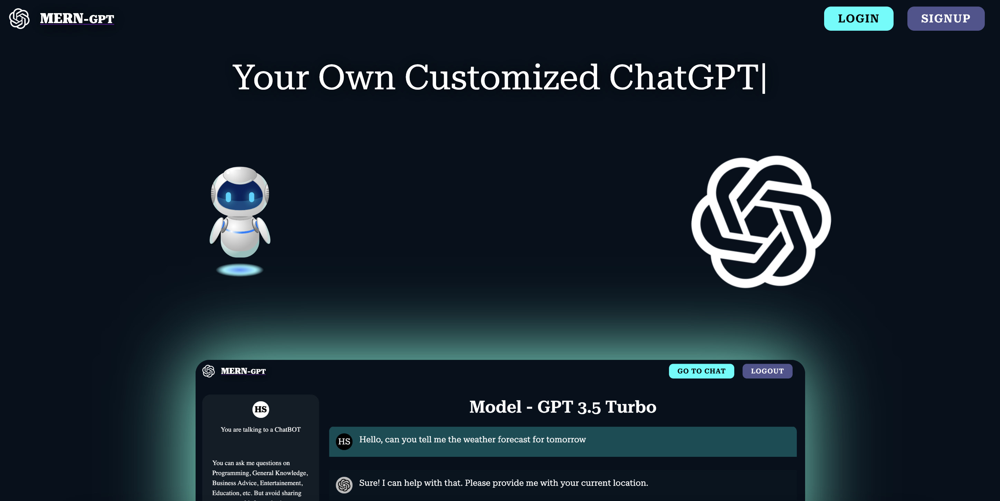
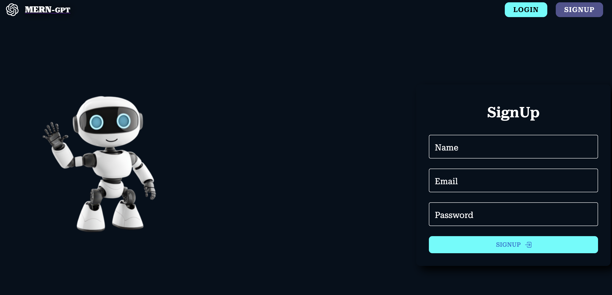

# ChatGPT Clone - MERN Stack

This is a ChatGPT clone built using the MERN stack (MongoDB, Express, React, Node.js). The application allows users to interact with a chatbot powered by GPT-like models, integrated with OpenAI for real-time question answering. It uses MongoDB for data storage, Express and Node.js for the backend API, and React for the frontend.


## Features

- **User Authentication**: Secure login/signup with JWT.
- **Chat Interface**: Real-time interaction with a chatbot.
- **Backend API**: Express server with routes for authentication and messaging.
- **Database**: MongoDB for storing user data and chat history.
- **Real-time Responses**: Integrated with OpenAI API for generating responses to user queries.
- **Responsive UI**: Built with React for a smooth user experience.


## Technologies Used

- **Frontend**: React.js, Axios (for API calls)
- **Backend**: Node.js, Express.js
- **Database**: MongoDB, Mongoose
- **Authentication**: JWT (JSON Web Token)
- **Styling**: CSS, Material-UI (or any other UI library you prefer)
- **Environment Variables**: `.env` for managing sensitive information
- **OpenAI API**: For integrating the GPT-like model for real-time question answering


## Prerequisites

Before you begin, ensure you have the following installed:

- **Node.js**: [Download and Install Node.js](https://nodejs.org/)
- **MongoDB**: [Download and Install MongoDB](https://www.mongodb.com/try/download/community)
- **npm**: Node Package Manager (comes with Node.js)
- **OpenAI API Key**: [Get your OpenAI API Key](https://beta.openai.com/signup/)


## Installation

### 1. Clone the Repository

```bash
git clone https://github.com/your-username/chatgpt-clone.git
cd chatgpt-clone
```

## 2. Install Dependencies

### Backend

Navigate to the backend folder and install dependencies:

```bash
cd backend
npm install
```

## Frontend

Navigate to the frontend folder and install dependencies:

```bash
cd frontend
npm install
```

## Setup Environment Variables

Create a `.env` file in the root of the project (both frontend and backend) with the following environment variables:

### Backend `.env` (in `backend/` folder)
```bash
MONGO_URI=mongodb://localhost:27017/chatgpt-clone
JWT_SECRET=your_jwt_secret_key
OPENAI_API_KEY=your_openai_api_key
```

### Frontend `.env` (in `frontend/` folder)
```bash
REACT_APP_API_URL=http://localhost:5000
```
Make sure to replace `your_jwt_secret_key` with your actual secret key for JWT authentication and `your_openai_api_key` with your OpenAI API key.

## Running the Application

### 1. Start the Backend

Navigate to the backend folder and run the server:

```bash
cd backend
npm run dev
```
This will start the backend server on `http://localhost:5000`.

### 2. Start the Frontend

Navigate to the frontend folder and run the server:

```bash
cd frontend
npm run dev
```
This will start the backend server on `http://localhost:3000`.

## Screenshots
Below are some screenshots of the working model:

### 1. Home Page


### 2. Login Page


### 3. SignUp Page


### 4. Chat Page


### 5. Clear Chat Page


## Contributing
Feel free to fork the repository, make changes, and submit a pull request. All contributions are welcome!
